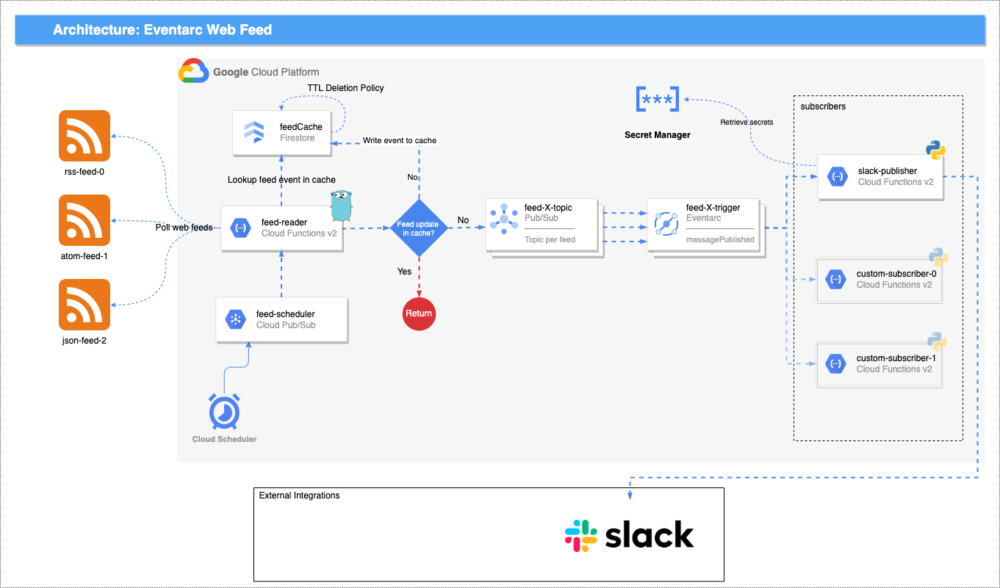

# Eventarc Web Feed
Web syndication is a form of syndication in which content is made available from one website to other sites via pollable feeds. Over the years, the industry has standardized around certain web syndication web feed protocols such as [RSS](https://en.wikipedia.org/wiki/RSS), [Atom](https://en.wikipedia.org/wiki/Atom_(web_standard)), and most recently, [JSON Feed](https://en.wikipedia.org/wiki/JSON_Feed), for exposing site content updates to users. Despite the age of these protocols, they are still widely used today for publishing consumable feeds. 
  
In recent years, we have seen the rise of event-driven architectures. This architectural pattern may be applied by the design and implementation of applications and systems that transmit events among loosley coupled software componenets and services. Event-driven systems typically consist of event producers, event routers, and event consumers. Producers publish events to routers, which then are responsible for delivering them to consumers. In 2019, the CNCF released v1.0 of the [CloudEvents](https://github.com/cloudevents/spec) spec/protocol, which intends to standardize a specification for describing event data in common formats to provide interoperability across services, platforms and systems. 
  
This project serves as a bridge between existing legacy web feed formats such as RSS, Atom, and JSON, and the more modern CloudEvents spec. It intends to enable the development of event-driven systems that react to legacy web feed events.
  
# Google Disclaimer
This is not an officially supported Google product

## Services
- Cloud Scheduler
- Cloud Functions v2
- Pub/Sub
- Eventarc
- Firestore
- Secret Manager
- Cloud Storage

## Required permissions to deploy
- `roles/editor`
- `roles/owner` _(if you need to disable org policies)_

## Dependencies
### If not using devcontainer
- `terraform ~> 1.3.0`
- `gcloud cli ~> 385.0.0`
- gcloud beta component
    - `gcloud components install beta`  

### If using devcontainer
- `gcloud cli ~> 385.0.0`
- `docker`
- `devcontainer`
  - [https://code.visualstudio.com/docs/devcontainers/containers](https://code.visualstudio.com/docs/devcontainers/containers)
  
## Required GCP APIs
All GCP APIs required for this solution are documented in [./.config/apis.txt](./.config/apis.txt). By default, `make tf-backend` will enable each of these APIs
   

## Organization Policies
The Org Policy constraints which could prevent this solution from being deployed are documented in [./.config/disable_boolean_constraint_policies.txt](./.config/disable_boolean_constraint_policies.txt) and [./.config/disable_list_constraint_policies.txt](./.config/disable_list_constraint_policies.txt). If your deployment is being blocked, uncomment line #98 in [./scripts/create_tf_backend.sh](./scripts/create_tf_backend.sh) and rerun `make tf-backend`. Please note that you must have permissions to remove Orgnization Policies from your project in order for this to work.
  
## How to deploy
```bash
# Clone repo 
export GITHUB_PROJECT_NAME="eventarc-web-feed"
export GCP_PROJECT_ID="REPLACE_ME"

git clone git@github.com:noahmercado/${GITHUB_PROJECT_NAME}.git

cd ${GITHUB_PROJECT_NAME}

# If deploying using the devcontainer, run `devcontainer open` to open a new VS Code workspace inside the devcontainer

# Review the default configuration in config.tfvars and modify as needed (review the README in terraform/ to see input options)
# Additinoal configuration examples can be found in ./examples

# Log in to gcloud cli 
gcloud auth login --update-adc

# Configure your CLI to point to the GCP project you want to deploy into
gcloud config set project ${GCP_PROJECT_ID}

# Prepare the GCP project
make tf-backend

# Deploy the web App
make app
```

## Architecture


## Subscribers
Learn more about feed subscribers at [./src/subscribers/README.md](./src/subscribers/README.md) 
  
## Tech stack


