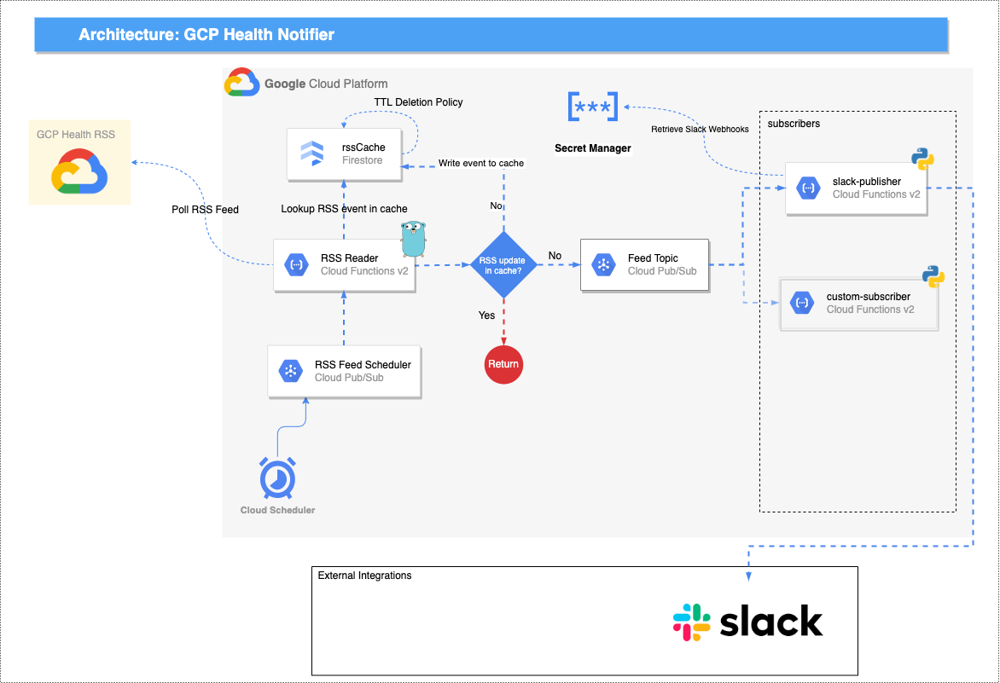

# GCP Service Health Notifications
This example configuration builds a datapipeline for monitoring the GCP Service Health RSS Feed and notifying "subscribers". It deploys the prebuilt "slack-publisher" subscriber which can be used to publish notifications to a Slack webhook.

## How to deploy
```bash
# Clone repo 
export GITHUB_PROJECT_NAME="eventarc-web-feed"
export GCP_PROJECT_ID="REPLACE_ME"

git clone git@github.com:GoogleCloudPlatform/${GITHUB_PROJECT_NAME}.git

cd ${GITHUB_PROJECT_NAME}

# Enable the example configuration 
mv ./examples/gcp-service-health-notifications/gcp-service-health.config.tfvars ./config.tfvars

# Review the default configuration in config.tfvars and modify as needed
# Additinoal configuration examples can be found in ./examples

# Log in to gcloud cli 
gcloud auth login --update-adc

# Configure your CLI to point to the GCP project you want to deploy into
gcloud config set project ${GCP_PROJECT_ID}

# Prepare the GCP project
make tf-backend

# Deploy the web App
make app
```

## Architecture


## Subscribers
Learn more about feed subscribers at [../../src/subscribers/README.md](../..//src/subscribers/README.md) 
